# context.md — Omnopticon / Argus Recon Platform

Generated: 2026-05-26  
Repository: `https://github.com/feliciamizula-cpu/omnopticon`  
Project name in code/docs: **Argus Recon Platform**. The GitHub repo is named **omnopticon** and is forked from `dotnet/eShop`, so some old eShop names still appear in solution, package, Playwright, or cleanup documentation.

---

## 0. First 10 minutes for any AI agent

1. Read this file.
2. Check current git state and do not revert unrelated dirty work.
3. Check `ai_logs.txt` and `.agents/locks/` before modifying files.
4. Lock each file before editing:
   ```bash
   echo "AGENT_ID:{your-id}|TIMESTAMP:{ISO8601}|TASK:{task}" > .agents/locks/{your-id}_{filename}.lock
   ```
5. Append activity to `ai_logs.txt` using:
   ```text
   [TIMESTAMP] | AGENT_ID: {id} | TASK: {task} | STATUS: {status} | MESSAGE: {message}
   ```
6. Treat this as a security/recon system. Preserve scope validation, rate limiting, and authorized-target boundaries.
7. Build or test after meaningful changes. Prefer incremental, focused commits.

---

## 1. What this project is

**Argus** is a distributed, event-driven bug-bounty reconnaissance and attack-surface monitoring platform. It discovers, processes, classifies, stores, and visualizes assets across authorized bug-bounty targets.

Core concepts:

- **Program**: A bug-bounty program or organization context.
- **Scope**: In-scope and excluded domains, CIDRs, URL patterns, or targets.
- **Asset**: The central domain entity. Domains, subdomains, IPs, URLs, HTTP responses, pages, JavaScript files, API endpoints, technologies, ports, DNS records, findings, and scopes are modeled as assets or asset-related records.
- **Task**: Durable work item with leasing, progress, checkpoints, completion/failure state, and retry potential.
- **Worker**: Background service that leases tasks and performs bounded reconnaissance work.
- **Event**: Integration event sent through the Argus event bus and/or realtime stream.
- **Artifact**: Large or raw outputs such as HTTP bodies, screenshots, tool stdout/stderr, and extracted files. These should not be stored in hot relational rows.
- **Agent**: AI development/DevOps actor managed by `Argus.AgentService`, with provider/model routing and task records.

Primary safety rule: **no recon activity may run outside authorized scope**. HTTP-capable workers must validate scope and honor rate limits before network activity or asset publication.

---

## 2. Source-of-truth hierarchy

When sources disagree, prefer them in this order:

1. Live repository files.
2. `docs/ARGUS_IMPLEMENTATION_HANDOFF.md` for implementation status and roadmap.
3. `AI_START_HERE.md` for multi-agent coordination protocol.
4. Uploaded context files (`minimax_context.md`, `mistral_context.md`) for high-level explanation.
5. Historical eShop docs only for cleanup context.

Known conflicts normalized in this file:

- Use **.NET 10** from `global.json`, not .NET 8.
- Use **Argus** naming for new work. Do not reintroduce eShop services.
- The uploaded Mistral context mentions `autocollab/ai_team.py`, AutoGen, and pytest. The live repo path `autocollab/` was not present during inspection. Do not assume AutoCollab exists unless it is added or verified locally.
- Some Playwright/package metadata still references eShop. Treat those as migration leftovers unless the task explicitly concerns cleanup.
- Realtime docs mention both SignalR and SSE. Current Argus docs and frontend context emphasize **RealtimeService/SSE-style updates** via `DevelopmentRealtimeClient`.
- Deployment topology can be broader than the AppHost topology. Docker Compose and CD include services/workers that may not be registered in `src/Argus.AppHost/Program.cs`. Verify both before changing deployment.

---

## 3. Technology stack

Runtime and orchestration:

- .NET SDK: `10.0.100` pinned in `global.json`.
- Aspire: distributed application orchestration and local service discovery.
- ASP.NET Core: backend service APIs.
- Blazor: web command UI.
- YARP: API gateway / reverse proxy.
- Entity Framework Core + Npgsql: PostgreSQL access.
- Dapper: used in parts of `Argus.AgentService`.
- PostgreSQL with pgvector image: primary relational metadata store and vector-ready enrichment.
- Redis: leases, token buckets, caching, ephemeral state.
- RabbitMQ: integration event transport.
- OpenTelemetry/Aspire dashboard: logs, traces, metrics, health.
- Docker Compose: local container deployment.
- Terraform + GKE + KEDA + Aspirate: cloud deployment.
- Playwright: UI tests and browser automation support.
- External recon tools installed in service image when needed: Amass and Subfinder.

AI/provider tooling:

- `claude`
- `codex`
- `gemini`
- `opencode`
- NVIDIA/OpenRouter/OpenAI/Claude/Gemini provider metadata in agent seed/config flows.

---

## 4. Local development

### Aspire local run

```bash
# Prereqs: .NET SDK from global.json and Docker Desktop
dotnet restore eShop.slnx
dotnet build eShop.slnx
dotnet run --project src/Argus.AppHost/Argus.AppHost.csproj
```

Common local URLs:

| Component | URL |
|---|---|
| Argus Web | `http://localhost:8080` |
| API Gateway | `http://localhost:8081` |
| Realtime SSE | `http://localhost:8082` |
| Aspire Dashboard | `http://localhost:8088` |

The exact Aspire ports can be assigned by Aspire. Check the dashboard if a port differs.

### Docker Compose local run

```bash
cp deploy/argus.env.example deploy/argus.env
docker compose --env-file deploy/argus.env -f deploy/compose.yaml up --build -d
```

Useful verification:

```bash
docker compose --env-file deploy/argus.env.example -f deploy/compose.yaml config --quiet
tools/seed-demo-data.sh
curl -fsS http://localhost:8080/ui/state | jq
```

Compose services include PostgreSQL, Redis, RabbitMQ, MinIO, core Argus services, worker services, `agent-service`, and a review report server.

---

## 5. High-level architecture

```plantuml
@startuml
skinparam componentStyle rectangle

package "Argus.AppHost / Deployment Topology" {
  [Argus.Web\nBlazor Command UI] as Web
  [Argus.ApiGateway\nYARP] as Gateway

  package "Core Services" {
    [ProgramScopeService] as Scope
    [AssetService] as Asset
    [ArtifactService] as Artifact
    [FindingService] as Finding
    [TaskService] as Task
    [RateLimitService] as Rate
    [ScanOrchestratorService] as Orchestrator
    [RealtimeService] as Realtime
    [EventRouterService] as EventRouter
    [ProxyRegistryService] as ProxyRegistry
    [AgentService] as Agent
  }

  package "Workers" {
    [AmassWorker] as Amass
    [SubfinderWorker] as Subfinder
    [DnsResolverWorker] as Dns
    [HttpProbeWorker] as HttpProbe
    [HtmlDomSpiderWorker] as Html
    [HeadlessSpiderWorker] as Headless
    [JsExtractorWorker] as Js
    [WordlistDiscoveryWorker] as Wordlist
    [FingerprintWorker] as Fingerprint
    [AssetScoringWorker] as Scoring
    [FindingDeduperWorker] as Deduper
    [ValidationWorker] as Validation
    [AssetStorageWorker] as AssetStorage
    [RegexScannerWorker] as RegexScanner
  }

  database "PostgreSQL + pgvector\nargusdb" as Pg
  queue "RabbitMQ\neventbus" as Rabbit
  database "Redis" as Redis
  storage "MinIO/S3 or local artifacts" as ObjectStore
}

Web --> Gateway
Web --> Realtime
Gateway --> Scope
Gateway --> Asset
Gateway --> Artifact
Gateway --> Finding
Gateway --> Task
Gateway --> Rate
Gateway --> Orchestrator
Gateway --> EventRouter
Gateway --> Agent

Scope --> Pg
Asset --> Pg
Artifact --> Pg
Finding --> Pg
Task --> Pg
Task --> Redis
Rate --> Redis
Agent --> Pg
EventRouter --> Rabbit
Scope --> Rabbit
Asset --> Rabbit
Task --> Rabbit

Amass --> Task
Subfinder --> Task
Dns --> Task
HttpProbe --> Task
Html --> Task
Headless --> Task
Js --> Task
Wordlist --> Task
Fingerprint --> Task
Scoring --> Task
Deduper --> Task

Amass --> Asset
Subfinder --> Asset
Dns --> Asset
HttpProbe --> Asset
Html --> Asset
Js --> Asset
Fingerprint --> Asset
Scoring --> Finding
Deduper --> Finding
AssetStorage --> ObjectStore
Artifact --> ObjectStore

@enduml
```



---

## 6. Repository map

Top-level directories and files:

```text
.
├── .github/workflows/          # CI/CD, especially cd-gcp.yml
├── deploy/                     # Compose, Dockerfile, Terraform, Aspirate docs
├── docs/                       # Handoff, cleanup, implementation notes
├── e2e/                        # Playwright tests
├── src/
│   ├── Argus.AppHost/          # Aspire orchestrator / local topology
│   ├── Argus.ApiGateway/       # YARP gateway
│   ├── Argus.Web/              # Blazor command center
│   ├── Argus.ServiceDefaults/  # Shared health, telemetry, resilience
│   ├── Contracts/
│   │   └── Argus.Contracts/    # DTOs, event and API contracts
│   ├── BuildingBlocks/
│   │   ├── Argus.BuildingBlocks.Artifacts/
│   │   ├── Argus.BuildingBlocks.EventBus/
│   │   └── Argus.BuildingBlocks.Workers/
│   ├── Services/
│   │   ├── Argus.AgentService/
│   │   ├── Argus.ArtifactService/
│   │   ├── Argus.AssetService/
│   │   ├── Argus.EventRouterService/
│   │   ├── Argus.FindingService/
│   │   ├── Argus.ProgramScopeService/
│   │   ├── Argus.ProxyRegistryService/
│   │   ├── Argus.RateLimitService/
│   │   ├── Argus.RealtimeService/
│   │   ├── Argus.ScanOrchestratorService/
│   │   └── Argus.TaskService/
│   ├── Tools/
│   │   └── Argus.AgentCoordinator/
│   └── Workers/
│       ├── Argus.Workers.Amass/
│       ├── Argus.Workers.AssetScoring/
│       ├── Argus.Workers.AssetStorage/
│       ├── Argus.Workers.DnsResolver/
│       ├── Argus.Workers.FindingDeduper/
│       ├── Argus.Workers.Fingerprint/
│       ├── Argus.Workers.HeadlessSpider/
│       ├── Argus.Workers.HtmlDomSpider/
│       ├── Argus.Workers.Http/
│       ├── Argus.Workers.HttpProbe/
│       ├── Argus.Workers.JsExtractor/
│       ├── Argus.Workers.RegexScanner/
│       ├── Argus.Workers.Subfinder/
│       ├── Argus.Workers.Validation/
│       └── Argus.Workers.WordlistDiscovery/
├── tests/
│   ├── Argus.ApiGateway.Tests/
│   ├── Argus.Workers.AssetScoring.Tests/
│   ├── Argus.Workers.HtmlDomSpider.Tests/
│   └── Argus.Workers.HttpProbe.Tests/
├── tools/
│   ├── AgentLogViewer/
│   ├── reviews/
│   └── seed-demo-data.sh
├── AI_START_HERE.md
├── Directory.Packages.props
├── eShop.slnx
└── global.json
```

Important files:

| Purpose | Path |
|---|---|
| Aspire AppHost | `src/Argus.AppHost/Program.cs` |
| Web UI app | `src/Argus.Web/Program.cs` |
| Web pages | `src/Argus.Web/Pages/` |
| Agent UI | `src/Argus.Web/Pages/Agents.razor` |
| Agent service entry | `src/Services/Argus.AgentService/Program.cs` |
| Agent store context | `src/Services/Argus.AgentService/Data/AgentDbContext.cs` |
| Agent seed data | `src/Services/Argus.AgentService/Stores/AgentDevelopmentSeedData.cs` |
| Agent contracts | `src/Contracts/Argus.Contracts/Agents/AgentContracts.cs` |
| Task execution | `src/Services/Argus.AgentService/Agents/TaskExecutionService.cs` |
| Agent selection | `src/Services/Argus.AgentService/Agents/AgentSelectionService.cs` |
| Provider usage | `src/Services/Argus.AgentService/ProviderUsage/` |
| Event bus | `src/BuildingBlocks/Argus.BuildingBlocks.EventBus/` |
| Worker host | `src/BuildingBlocks/Argus.BuildingBlocks.Workers/` |
| Artifact abstraction | `src/BuildingBlocks/Argus.BuildingBlocks.Artifacts/` |
| Docker Compose | `deploy/compose.yaml` |
| Compose env template | `deploy/argus.env.example` |
| Service Dockerfile | `deploy/Dockerfile.service` |
| Terraform | `deploy/terraform/` |
| GKE CD workflow | `.github/workflows/cd-gcp.yml` |
| Agent coordination | `AI_START_HERE.md` |
| Implementation roadmap | `docs/ARGUS_IMPLEMENTATION_HANDOFF.md` |

---

## 7. AppHost topology

`src/Argus.AppHost/Program.cs` creates:

- Redis: `redis`
- RabbitMQ: `eventbus`
- PostgreSQL: `postgres`, using `ankane/pgvector`, with database `argusdb`

Core projects registered in AppHost include:

- `program-scope-service`
- `asset-service`
- `artifact-service`
- `finding-service`
- `task-service`
- `rate-limit-service`
- `scan-orchestrator-service`
- `realtime-service`
- `event-router-service`
- `proxy-registry-service`
- `argus-api-gateway`
- `argus-web`

Workers registered in AppHost include:

- `amass-worker`
- `subfinder-worker`
- `dns-resolver-worker`
- `http-probe-worker`
- `html-dom-spider-worker`
- `js-extractor-worker`
- `wordlist-discovery-worker`
- `headless-spider-worker`
- `fingerprint-worker`
- `validation-worker`
- `asset-scoring-worker`
- `finding-deduper-worker`

Most recon workers set:

```text
ARGUS_SCOPE_VALIDATION_REQUIRED=true
```

Watch out: `agent-service`, `http-worker`, `asset-storage-worker`, and `regex-scanner-worker` appear in Docker/CD-related files but may not be registered in AppHost. Keep local/deployment topology in sync when changing services.

---

## 8. Core services

### ProgramScopeService

Manages bug-bounty programs, scope includes/exclusions, program rules, rule revisions, rate-limit policy ownership, and scope validation.

Key responsibilities:

- Program CRUD.
- Scope creation.
- Scope validation endpoint.
- Scope exclusions.
- Rate-limit policy metadata.
- Program/scope event publication.
- Future: HackerOne/Bugcrowd/custom scope ingestion and signed scope snapshots.

### AssetService

Stores discovered assets and relationships.

Key responsibilities:

- Asset upsert by natural key.
- Asset query with paging/filtering/sorting.
- Asset relationship storage.
- Status transitions.
- Tag management.
- Risk/interesting score filtering.
- Future: bulk tagging, bulk enqueue, artifact/observation endpoints, full-text GIN indexes, stronger relationship uniqueness.

### ArtifactService

Coordinates scan artifacts. Artifact storage is supported by `Argus.BuildingBlocks.Artifacts` with local file and S3-style stores. Compose includes MinIO. Raw bodies, screenshots, and tool outputs should be written as artifacts, not as large relational fields.

### FindingService

Stores vulnerability findings and confirmed/deduped results. Finding candidates are usually produced by extraction/scoring workers and promoted after deduplication/validation.

### TaskService

Durable task orchestration service.

Key responsibilities:

- Task create/read/update.
- Lease/start/progress/complete/fail endpoints.
- PostgreSQL/in-memory backing.
- Redis-backed lease behavior where applicable.
- Outbox events for task lifecycle.
- Future: task dependency links, dedupe write path, backoff and partial-success retry policy.

### RateLimitService

Distributed multi-tier rate limiter.

Key responsibilities:

- Token buckets in Redis or memory.
- Dimensions: program, scope, host, domain, IP, worker, proxy.
- Rate-limit events.
- Future: persisted policy read path from ProgramScopeService, dynamic quota updates, audit trail, wait queue semantics, UI pressure metrics.

Every HTTP-capable worker should call this before network access.

### ScanOrchestratorService

Creates and manages scan plans and workflow orchestration.

Current/near-term responsibilities:

- Domain discovery plan creation.
- Initial task seeding.
- Asset-driven task planning.
- Future state machine: `ProgramAdded -> ScopeImported -> DomainAssetCreated -> SubdomainEnumerationRequested -> SubdomainAssetCreated -> HttpProbeRequested -> UrlAssetCreated -> HtmlSpiderRequested -> JsExtractorRequested -> ApiEndpointAssetCreated`.
- Future event consumers for program/scope/asset/task events.
- Future timeline, pause, resume, and recovery endpoints.

### RealtimeService

Streams live state/events to the web UI. Treat it as an SSE/realtime update service. Avoid pushing large grid updates item-by-item; batch high-volume event updates.

### EventRouterService

Routes integration events and supports event-driven workflows. Use it with the event bus and outbox/inbox patterns.

### ProxyRegistryService

Tracks proxy configuration/availability for workers that need proxy-aware recon while preserving rate and scope constraints.

### AgentService

AI agent configuration, task execution, provider usage tracking, chat, TODOs, code reviews, and system reports.

Key routes:

```text
GET    /agents
POST   /agents
GET    /agents/{agentId}
PUT    /agents/{agentId}
DELETE /agents/{agentId}
PATCH  /agents/{agentId}/pause
PATCH  /agents/{agentId}/resume
POST   /agents/{agentId}/assign/{taskId}

GET    /agent-tasks
POST   /agent-tasks
GET    /agent-tasks/{taskId}
PUT    /agent-tasks/{taskId}
DELETE /agent-tasks/{taskId}
POST   /agent-tasks/{taskId}/run

GET    /todos
POST   /todos
GET    /todos/{todoId}
PUT    /todos/{todoId}
DELETE /todos/{todoId}

GET    /code-reviews
GET    /system-reports

GET    /provider-usage
POST   /provider-usage/refresh
POST   /provider-usage/{providerId}/refresh
POST   /provider-usage/{providerId}/login
GET    /provider-usage/routing-preview

GET    /agent-chat/history
POST   /agent-chat
```

---

## 9. Workers and recon pipeline

Canonical event-driven workflow:

```text
AssetDiscovered(Domain)
  ├─ AmassWorker       -> Subdomain, DnsRecord
  └─ SubfinderWorker   -> Subdomain

SubdomainDiscovered
  └─ DnsResolverWorker -> Ip, DnsRecord
       └─ HttpProbeWorker -> Url, HttpResponse
            ├─ HtmlDomSpiderWorker  -> HtmlPage, Url, ApiEndpoint, JavaScriptFile
            ├─ HeadlessSpiderWorker -> Url, ApiEndpoint, JavaScriptFile, screenshots/artifacts
            ├─ JsExtractorWorker    -> ApiEndpoint, Url, FindingCandidate
            ├─ WordlistDiscovery    -> Url
            └─ FingerprintWorker    -> Technology

FindingCandidate
  ├─ AssetScoringWorker   -> scores/tags/candidate priority
  └─ FindingDeduperWorker -> Finding
```

Worker rules:

- Validate target scope before publishing assets.
- Rate-limit before outbound HTTP/network access.
- Do not perform exploit, credential, stealth, bypass, or intrusive behavior.
- Emit structured logs with worker id, task id, program id, scope id, target host, and correlation id where available.
- Persist large outputs as artifacts.
- Create parent/child relationships from input assets to produced assets.
- Make adapters deterministic and fixture-testable where possible.

Current implementation status from handoff:

- Shared worker host exists with registration, heartbeats, task leasing, progress reporting, rate-limit checks, scope validation, and produced asset publishing.
- `HttpProbeWorker` is the real adapter pattern to follow.
- Many other recon workers may still be simulated or partial adapters.
- Artifact helper APIs and checkpoint restore helpers remain important follow-up areas.

---

## 10. Data and persistence

### Main stores

| Store | Purpose |
|---|---|
| PostgreSQL / `argusdb` | Primary normalized metadata, service records, assets, tasks, findings, agent configs |
| pgvector | Vector-ready enrichment support |
| Redis | Rate limits, leases, cache, ephemeral coordination |
| RabbitMQ | Durable event transport |
| MinIO/S3/local filesystem | Artifact blobs and large raw output |

### AgentService database entities

`AgentDbContext` manages:

- `Agents`
- `AgentTasks`
- `ChatMessages`
- `ProviderAccounts`
- `ProviderUsageSnapshots`
- `CodeReviews`
- `SystemReports`
- Argus outbox records through `ConfigureArgusOutbox()`

Important agent DTO records live in:

```text
src/Contracts/Argus.Contracts/Agents/AgentContracts.cs
```

Core DTOs:

- `AgentDto`
- `CreateAgentRequest`
- `UpdateAgentRequest`
- `AgentTaskDto`
- `CreateAgentTaskRequest`
- `UpdateAgentTaskRequest`
- `CodeReviewDto`
- `SystemReportDto`
- `ChatMessageDto`
- `SendChatRequest`
- `ChatResponse`
- `AgentAction`

### Events and reliability

The project uses an Argus event bus building block with outbox/inbox patterns.

Use outbox for reliable publishing from EF-backed services. Use inbox/idempotency for consumers. Preserve correlation/causation metadata when adding new events.

Future/important gaps:

- Consumer dead-letter policy.
- Event type registry.
- Contract versioning.
- Correlation propagation from HTTP requests.
- Outbox support in services that do not yet use EF outbox.

---

## 11. Agent system

`Argus.AgentService` manages AI development/ops agents and tasks.

### Roles

| Role | Typical work | Priority |
|---|---|---|
| `junior_developer` | Small bug fixes, unit tests, simple implementation | low |
| `developer` | Moderate feature work, bug fixes, integration tests | standard |
| `senior_developer` | Complex implementation, architecture-sensitive fixes, reviews | standard |
| `junior_system_architect` | Design support, cross-service review | standard |
| `senior_system_architect` | System design, technical strategy, security review, reports | high |
| `junior_devops` | Routine infra automation and health checks | low |
| `senior_devops` | Deployment automation, health monitoring, recovery | standard |
| `devops_architect` | Platform architecture and DevOps strategy | high |

### Supported tools

- `claude`
- `codex`
- `gemini`
- `opencode`

### Seeded model routing

`AgentDevelopmentSeedData` seeds examples such as:

- NVIDIA MiniMax M2.7 for junior/developer low-cost tasks.
- NVIDIA Qwen3 Coder and Mistral Large for architecture/DevOps support.
- Claude Sonnet/Opus for developer and senior architect roles.
- GPT-5.x variants for senior developer/system architect/DevOps architect roles.
- OpenRouter free variants for low-priority tasks.

### Agent selection

`AgentSelectionService`:

1. Lists agents.
2. Filters by exact role and `Status == "active"`.
3. Orders by `SortOrder`.
4. Returns the first runnable agent and wraps it in `CliChatClient`.

Direct assignment by GUID bypasses role selection.

### Task execution

`TaskExecutionService`:

1. Loads an agent task.
2. Uses assigned agent if present; otherwise selects by `TargetRole` or defaults to `developer`.
3. Marks task `in_progress`.
4. Marks agent `working`.
5. Invokes the selected CLI/model through `IChatClient`.
6. Records provider usage start/end when available.
7. Writes code-review/system-report artifacts for matching task types.
8. Parses `ACTION:CREATE_TASK ...` lines from output to create follow-up tasks.
9. Marks one-off tasks `completed` or `failed`; recurring/triggered tasks return to `scheduled`.
10. Dispatches triggered tasks, especially `agent_task_completed`.

Agent output can create tasks with this exact format:

```text
ACTION:CREATE_TASK priority="high|normal|low" targetRole="junior_developer|developer|senior_developer|devops|system_architect" taskType="implementation|bugfix|review|ops" description="detailed implementation instructions"
```

### Agent UI

The web UI at `/agents` and `/development/agents` displays:

- Name
- Role
- CLI/tool
- Provider
- Model
- Priority
- Command
- Create/edit modal
- Enable/pause/resume-style controls
- Inspector details

Related pages:

| Route | Purpose |
|---|---|
| `/agents` | Agent configuration management |
| `/agent-tasks` | Agent task queue and assignment |
| `/agent-schedules` | Scheduled/recurring tasks |
| `/provider-usage` | Provider usage monitoring |
| `/code-reviews` | Code review outputs |
| `/system-reports` | System reports |
| `/todos` | TODO items delegated to agents |

---

## 12. Web UI

`src/Argus.Web` is the Blazor command center.

Expected UI areas:

- Operations dashboard.
- Programs/scopes.
- Assets explorer and search.
- Asset row inspector and relationship rail.
- Agent configuration and agent task views.
- Provider usage.
- Code reviews and system reports.
- Environments.
- TODOs.
- Live events / realtime updates.
- Future: dense virtualized asset grid, saved views, bulk tagging, task monitor controls, worker fleet controls, rate-limit pressure view, asset graph visualization.

UI guidance:

- Keep it dense and operational; do not turn it into a marketing dashboard.
- Use server-side paging/filtering/sorting for large grids.
- Batch high-volume realtime updates.
- Avoid rendering an entire asset graph at once; render selected neighborhoods.
- Add `/ui/*` proxy endpoints only when same-origin browser access needs them.

---

## 13. Deployment

### Docker image

`deploy/Dockerfile.service` is parameterized by:

- `PROJECT_PATH`
- `ASSEMBLY_NAME`
- `DOTNET_VERSION`
- `GIT_SHA`
- `BUILD_DATE`

It publishes the selected .NET project and runs `dotnet $ASSEMBLY_DLL`.

Special cases:

- `Argus.Workers.Amass`: installs Amass.
- `Argus.Workers.Subfinder`: installs Subfinder.
- `Argus.AgentService`: installs Node.js/npm and OpenAI Codex CLI.

### Docker Compose

`deploy/compose.yaml` defines shared env:

```text
ARGUS_PROGRAM_SCOPE_SERVICE
ARGUS_ASSET_SERVICE
ARGUS_ARTIFACT_SERVICE
ARGUS_FINDING_SERVICE
ARGUS_TASK_SERVICE
ARGUS_RATE_LIMIT_SERVICE
ARGUS_SCAN_ORCHESTRATOR_SERVICE
ARGUS_EVENT_ROUTER_SERVICE
ARGUS_REALTIME_SERVICE
ARGUS_PROXY_REGISTRY_SERVICE
ConnectionStrings__argusdb
ConnectionStrings__redis
ConnectionStrings__eventbus
```

Provider variables for `agent-service` include:

```text
ANTHROPIC_API_KEY
OPENAI_API_KEY
OPENROUTER_API_KEY
FIREWORKS_API_KEY
GEMINI_OAUTH_CLIENT_ID
GEMINI_OAUTH_CLIENT_SECRET
CODEX_* limits
OPENCODE_* usage values
```

Do not commit real secrets. Use `deploy/argus.env` locally and platform secrets in CI/CD.

### GCP/GKE CD

`.github/workflows/cd-gcp.yml` deploys on push to `main` and manual dispatch:

1. Authenticate to GCP through Workload Identity Federation.
2. Provision/update Terraform infrastructure.
3. Build and push service/worker images to Artifact Registry.
4. Generate Kubernetes manifests with Aspirate.
5. Patch manifests as needed.
6. Apply workloads with Terraform.
7. Create public LoadBalancers for Argus web and Aspire dashboard.

Required GitHub secrets:

```text
WIF_PROVIDER
WIF_SERVICE_ACCOUNT
```

Terraform resources include:

- GKE cluster.
- Core node pool.
- Worker node pool.
- Artifact Registry.
- GKE node service account and IAM.
- Kubernetes namespace `argus`.
- KEDA.
- Aspirate-generated workloads.
- HPAs for continuous workers.
- Public services for web and Aspire dashboard.

---

## 14. Testing

Current test directories:

```text
tests/Argus.ApiGateway.Tests/
tests/Argus.Workers.AssetScoring.Tests/
tests/Argus.Workers.HtmlDomSpider.Tests/
tests/Argus.Workers.HttpProbe.Tests/
```

Functional tests may require Docker/Aspire.

Recommended verification commands:

```bash
dotnet build src/Argus.AppHost/Argus.AppHost.csproj
docker compose --env-file deploy/argus.env.example -f deploy/compose.yaml config --quiet
dotnet test
```

Playwright config may still reference eShop paths and `http://localhost:5045`. Treat that as a cleanup target before relying on Playwright in CI.

High-priority tests to add/maintain:

1. Scope validation:
   - exact include
   - wildcard include
   - exclusion override
   - CIDR match
   - URL pattern match
2. Asset identity:
   - natural key dedupe
   - metadata merge
   - relationship dedupe
3. Task lifecycle:
   - create
   - lease
   - start
   - progress
   - complete
   - fail
   - retry after lease expiration
4. Rate limiting:
   - per-host bucket
   - per-program bucket
   - denied requests return retry delay
5. Event bus:
   - outbox enqueue
   - dispatcher marks processed
   - failed dispatch retries
   - inbox idempotency
6. Worker parsers:
   - Amass output fixtures
   - Subfinder output fixtures
   - HTML extraction fixtures
   - JS extraction fixtures

Never make CI depend on live external recon targets.

---

## 15. MVP target

End-to-end MVP flow:

```text
Create program
  -> Add in-scope domain
  -> Emit DomainAssetDiscovered
  -> Run Subfinder/Amass tasks
  -> Save subdomains
  -> Emit SubdomainAssetDiscovered
  -> HTTP probe subdomains under rate limit
  -> Save URL and HTTP response assets
  -> Extract links from HTML
  -> Save new URL/API/JS assets
  -> Score and dedupe finding candidates
  -> Show events/assets/tasks live in UI
```

Definition of done for MVP:

- Fresh clone can run with Aspire or Docker Compose.
- Demo data can be seeded.
- A real in-scope domain can be added.
- System automatically creates domain/subdomain/URL/content tasks.
- Workers execute bounded, rate-limited, scoped recon.
- Assets and relationships are durably stored.
- Raw artifacts are stored outside hot relational rows.
- Events are delivered through outbox/inbox with idempotent consumers.
- Web UI shows programs, scopes, assets, relationships, tasks, workers, events, HTTP traffic, tool runs, and rate limits.
- Failed tasks can be inspected and retried.
- Tests cover core safety and reliability.
- No exploit, credential, stealth, bypass, or unauthorized behavior has been added.

---

## 16. Current implementation status snapshot

Use this as a starting hypothesis and verify locally before coding.

Mostly present:

- Argus AppHost.
- ServiceDefaults for telemetry/health/resilience.
- Docker Compose deployment.
- GKE/Terraform/Aspirate deployment path.
- Demo seed script.
- ProgramScopeService core CRUD/scope validation.
- AssetService upsert/query/relationships/status/tags.
- TaskService durable lifecycle basics.
- RateLimitService token bucket basics.
- Scan plan creation and initial task seeding.
- Event bus publisher/outbox and inbox basics.
- Realtime events.
- Worker host with leasing/heartbeats/progress/scope/rate-limit basics.
- Real HttpProbeWorker pattern.
- Blazor command center shell and operations views.
- AgentService with agents/tasks/todos/provider usage/chat/code reviews/system reports.
- Artifact abstractions and local/S3-style stores.

Important incomplete or risky areas:

- AppHost/deployment topology drift.
- Simulated or partial workers beyond HttpProbe.
- Full ScanOrchestrator event-driven state machine.
- Task dedupe write path and workflow duplicate avoidance.
- Artifact API integration with AssetService/UI.
- Rich asset explorer and task/worker controls.
- Custom metrics and trace correlation.
- Auth, authorization, multi-user/org boundaries.
- Playwright/eShop cleanup.
- AutoCollab docs are stale unless path is added.

---

## 17. Rules for adding or changing services

When adding a service:

1. Create project under `src/Services/Argus.{Name}Service/`.
2. Use existing Argus patterns before adding abstractions.
3. Add service defaults, health, problem details, and OpenTelemetry.
4. Register service in `src/Argus.AppHost/Program.cs` if it must run under Aspire.
5. Add Docker Compose entry if it must run under Compose.
6. Add CD matrix entry in `.github/workflows/cd-gcp.yml`.
7. Add connection env vars to `deploy/argus.env.example` if needed.
8. Add contracts in `src/Contracts/Argus.Contracts/` when the API is shared.
9. Add tests or at least a smoke test.
10. Update this context or a more specific handoff doc.

When adding a worker:

1. Create project under `src/Workers/Argus.Workers.{Capability}/`.
2. Use `Argus.BuildingBlocks.Workers` for registration, leases, heartbeat, and task lifecycle.
3. Validate scope.
4. Call RateLimitService for HTTP/network activity.
5. Emit produced assets through AssetService.
6. Store raw outputs as artifacts.
7. Add AppHost/Compose/CD entries.
8. Add parser/unit tests with fixtures.
9. Do not use live external recon targets in tests.

When adding an event:

1. Define or update contract in `Argus.Contracts`.
2. Include event versioning strategy if schema may evolve.
3. Preserve correlation and causation IDs.
4. Publish through outbox where EF-backed.
5. Add idempotent consumer behavior.
6. Add tests for duplicate message handling.

---

## 18. Security and compliance guardrails

Allowed:

- Authorized target discovery.
- Passive enumeration.
- Bounded HTTP probing.
- Metadata extraction.
- Asset graphing.
- Finding candidate generation from non-invasive analysis.
- Defensive validation and reporting.

Not allowed for this project unless explicitly authorized and safely bounded by a human:

- Exploitation.
- Credential attacks.
- Stealth/evasion.
- Bypass techniques.
- Unbounded recursive crawling.
- High-rate scanning.
- Targeting outside declared scope.
- Storing secrets in source control.
- Publishing raw sensitive artifacts without retention/access controls.

Implementation guardrails:

- Check scope before network actions and asset publication.
- Enforce per-program/per-scope/per-host rate limits.
- Normalize URLs safely.
- Persist audit events for scope changes, policy changes, task retry/cancel, and artifact access when auth/audit work is implemented.
- Keep artifacts size-limited and out of relational hot paths.
- Use env vars, user secrets, or secret providers for credentials.

---

## 19. Known cleanup notes

This repository began as an eShop fork. Historical artifacts may remain.

Remove or update eShop references only when the task is specifically cleanup or when they break builds/tests. Do not reintroduce deleted commerce services.

Known eShop-like remnants to watch:

- `eShop.slnx` solution file name.
- `package.json` name/description.
- `playwright.config.ts` webServer command and baseURL.
- Documentation references in cleanup notes.
- Any old test/project references.

---

## 20. Common commands

```bash
# Restore/build
dotnet restore eShop.slnx
dotnet build eShop.slnx

# Run AppHost
dotnet run --project src/Argus.AppHost/Argus.AppHost.csproj

# Compose config validation
docker compose --env-file deploy/argus.env.example -f deploy/compose.yaml config --quiet

# Compose up
cp deploy/argus.env.example deploy/argus.env
docker compose --env-file deploy/argus.env -f deploy/compose.yaml up --build -d

# Seed demo data
tools/seed-demo-data.sh

# Tests
dotnet test

# AgentService migrations example
cd src/Services/Argus.AgentService
dotnet ef migrations add AddNewField --context AgentDbContext

# Aspirate manifests
dotnet tool restore
cd src/Argus.AppHost
aspirate init
aspirate generate --non-interactive --disable-secrets

# Terraform deploy flow
terraform -chdir=deploy/terraform init
terraform -chdir=deploy/terraform apply -var='project_id=project-30b3b95e-ed2b-4573-98a'
```

---

## 21. How to approach tasks in this repo

For bug fixes:

1. Reproduce or inspect the failing path.
2. Find the owning service/worker/UI page.
3. Check contracts before changing API shapes.
4. Add the smallest safe fix.
5. Add regression tests where feasible.
6. Build/test.
7. Update logs and release locks.

For features:

1. Confirm whether it belongs in service, worker, UI, deployment, or agent system.
2. Follow existing patterns.
3. Keep scope/rate/artifact/event requirements in the design.
4. Add contracts first if multiple projects need the data shape.
5. Implement service/store logic.
6. Add UI/proxy only as needed.
7. Add tests and verification commands.
8. Update documentation if behavior changes.

For architecture changes:

1. Read `docs/ARGUS_IMPLEMENTATION_HANDOFF.md`.
2. Compare AppHost, Compose, CD, and Terraform topology.
3. Avoid big-bang refactors.
4. Preserve backward-compatible contracts where possible.
5. Prefer event-driven, idempotent, retryable workflows.
6. Make failure states visible in UI/logs.

---

## 22. Quick mental model

Argus is not a scanner script. It is a distributed workflow platform:

```text
Programs and scopes define what is legal.
Tasks define what work should happen.
Workers perform safe bounded work.
Assets are the shared graph of what was found.
Events connect services and update the UI.
Rate limits protect targets and the platform.
Artifacts store raw evidence outside relational rows.
Agents help develop, review, and operate the system.
```

Keep every change aligned with that model.
