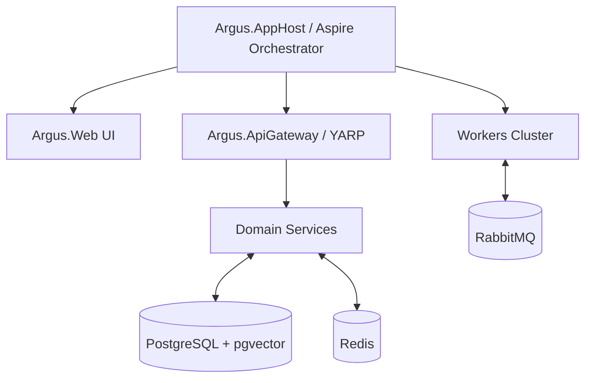

# Argus Recon Platform: Architectural Overview

Argus is a distributed, event-driven bug-bounty reconnaissance platform designed to discover, process, and analyze digital assets at scale. It leverages the .NET Aspire framework for orchestration and service management.

## High-Level Architecture

The system follows an event-driven, microservices-oriented architecture orchestrated by **.NET Aspire**.



## Core Components

### 1. Orchestration (.NET Aspire)
The `Argus.AppHost` project defines the lifecycle of all services, workers, and infrastructure components. It handles dependency injection, service discovery, and configuration management across the distributed system.

### 2. Services
The system is divided into domain-driven services that manage specific entities:
- **Core Entities:** Managed via `AssetService`, `FindingService`, and `ProgramScopeService`.
- **Infrastructure Services:** `EventRouterService` (message routing), `TaskService` (distributed work orchestration), `RateLimitService` (tiered resource management), and `RealtimeService` (SSE notifications).

### 3. Workers
Workers are specialized, ephemeral processes responsible for recon tasks. They:
- Subscribe to events on the `RabbitMQ` message bus.
- Perform specific reconnaissance operations (discovery, probing, extraction).
- Report results back as new asset discoveries or findings.

### 4. Event-Driven Workflow
The platform utilizes an asynchronous pipeline where the discovery of one asset triggers downstream reconnaissance workers.

1.  **Asset Discovered:** Initial input (e.g., Domain).
2.  **Workers Execute:** Amass/Subfinder resolve the domain.
3.  **Recursive Discovery:** DnsResolver -> HttpProbe -> HtmlDomSpider -> JsExtractor.
4.  **Enrichment/Scoring:** Fingerprint and AssetScoring workers analyze assets.
5.  **Finding Generation:** FindingDeduper filters candidates into actionable findings.

## Key Technologies
- **Backend:** .NET 10
- **Message Broker:** RabbitMQ
- **Data Persistence:** PostgreSQL (with `pgvector` for advanced analysis), Redis (caching, leasing, rate limits)
- **Networking:** YARP (Yet Another Reverse Proxy) for API gateway and routing
- **Testing:** Playwright (for E2E browser-based tests)

## Getting Started for Developers

### Prerequisites
- .NET SDK (as defined in `global.json`)
- Docker Desktop (for infrastructure services)

### Running Locally
To launch the full stack locally:
```bash
# From the project root
dotnet run --project src/Argus.AppHost/Argus.AppHost.csproj
```
The Aspire dashboard will automatically open, providing logs, traces, and service status for all components.

### Structure Quick-Reference
- `/src/Argus.AppHost`: The entry point and orchestrator.
- `/src/Services`: The core business logic and state management.
- `/src/Workers`: The reconnaissance engines.
- `/src/BuildingBlocks`: Reusable infrastructure code (EventBus, Worker base classes).
- `/deploy`: Contains configuration for production environments and `docker-compose` files.
